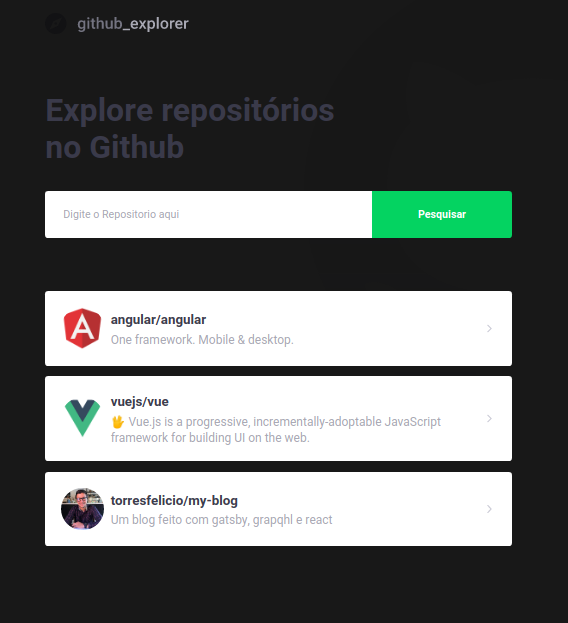

<h1 align="center">
    
    <br>
</h1>

<h4 align="center">
  Project using github's public api to search for repositories, issues.
</h4>

<h4 align="center">
    
    <br>
</h4>

<p align="center">
  

  

  


</p>

<p align="center">
  <a href="#como-executar">Como Executar</a>
</p>

## Como executar


```bash
# Clone this repository
$ git clone https://github.com/torresfelicio/explorer-github.git

# Go into the repository
$ cd explorer-github

# Install dependencies
$ npm install

# Run the app
$ yarn start
```

---

Feito com ♥ Lucas Torres :wave: [Entre em contato!](https://www.linkedin.com/in/torresfelicio/)
